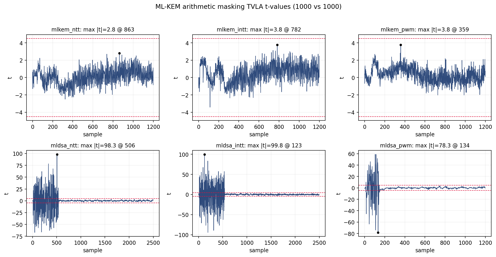
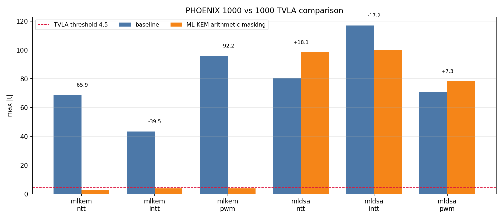
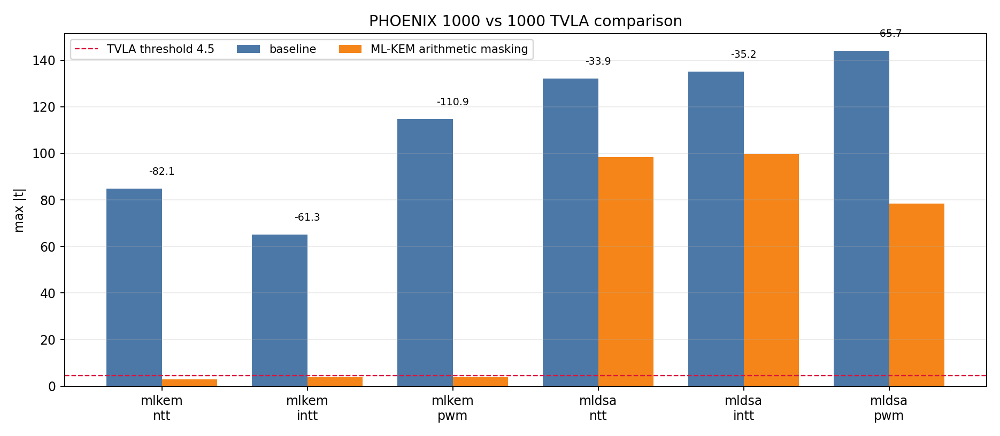
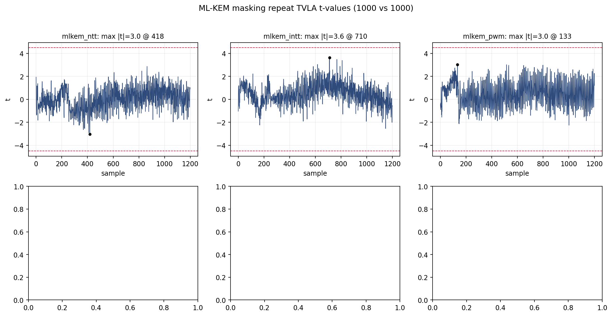

# Stage AM3: ML-KEM Full Masked Six-Operation Run

## 목적

AM1/AM2를 합친 현재 RTL이 full six-op TVLA에서 어떤 trade-off를 만드는지 확인한다.
ML-KEM 세 operation은 masking 대상이고, ML-DSA 세 operation은 기능적으로 기존 unmasked
datapath 그대로다. 다만 추가 memory, masked COMP3 logic, routing 변화가 placement에
영향을 줄 수 있으므로 ML-DSA도 반드시 같이 측정한다.

## 현재 구현 요약

기준점은 commit `5c0a201`의 COMP3 internal Stage 2 후보이며, 그 후보의 다음 처리는
유지된다.

- invalid-cycle public PRD flushing.
- COMP1/2/4의 unused input zero blanking.
- ML-KEM mode에서 COMP3 내부 inactive DSA Karatsuba cone public PRD.
- ML-KEM mode에서 inactive DSA Montgomery reducer input zero.

그 위에 다음 arithmetic masking을 추가했다.

- region 1 mask memory 추가.
- region 2 random tape memory 추가.
- ML-KEM input polynomial을 trace마다 fresh share0/share1로 split.
- ML-KEM COMP1/COMP2/COMP4 share-wise arithmetic.
- ML-KEM COMP3 public constant multiplication share-wise arithmetic.
- ML-KEM PWM secret-secret multiplication two-share masked multiplication.
- ML-KEM result share를 region 0/1에 유지.
- ML-DSA result path는 unmasked 기존 path 유지.

## 산출물

| 항목 | 값 |
|---|---|
| 기준 commit | `5c0a201` |
| bitstream | `boards/cw305/output/phoenix_cw305.bit` |
| bitstream mtime | `2026-05-21 12:28:19 +0900` |
| timing report | `boards/cw305/reports/phoenix_timing.rpt` |
| utilization report | `boards/cw305/reports/phoenix_impl_util.rpt` |
| smoke log | `reports/tvla/arithmetic_masking_mlkem_smoke_260521/tvla_run.log` |
| full TVLA | `reports/tvla/arithmetic_masking_mlkem_full_260521/summary.csv` |

## Full TVLA Command

```bash
OUTDIR=reports/tvla/arithmetic_masking_mlkem_full_260521 \
OPS='mlkem_ntt mlkem_intt mlkem_pwm mldsa_ntt mldsa_intt mldsa_pwm' \
TRACES=1000 SECRET_DIST=auto TRACE_ORDER=shuffle ORDER_SEED=0x5EED \
bash scripts/tvla/run_mlkem_mldsa_1000.sh
```

비교 대상:

- original baseline.
- `5c0a201` COMP3 internal Stage 2 후보.
- AM1/AM2 분리 측정 결과.

## TVLA 실행 이슈

1 trace/group smoke를 먼저 시도했다.

```bash
OUTDIR=reports/tvla/arithmetic_masking_mlkem_smoke_260521 \
OPS='mlkem_ntt mlkem_intt mlkem_pwm' \
TRACES=1 SECRET_DIST=auto TRACE_ORDER=shuffle ORDER_SEED=0x5EED \
bash scripts/tvla/run_mlkem_mldsa_1000.sh
```

실패 원인은 capture script나 RTL mismatch가 아니라 CW305/ChipWhisperer USB session open
실패다. 장비 재연결 후 direct USB/libusb 권한으로 smoke는 통과했다.

```text
usb1.USBErrorOther: LIBUSB_ERROR_OTHER [-99]
```

full run 중 `mldsa_intt`에서 bulk preload status magic low byte가 `0x31` 대신 `0x11`로
읽히는 현상이 있었다. field1/field2/field3는 정상 완료 값이었고, direct probe에서는
bulk write 자체가 정상임을 확인했다. 그래서 `scripts/tvla/phoenix_cw305_lib.py`에서
status-only alias `0x50485811`을 허용하고, bulk chunk마다 status를 확인하도록 loader를
강화했다. 이 변경 뒤 `mldsa_intt` 1 trace/group smoke와 1000/1000 retry가 통과했다.

## TVLA 결과

Full run 결과:

| Operation | `5c0a201` candidate | AM3 masked | peak index | cycles | clipping | 판단 |
|---|---:|---:|---:|---:|---:|---|
| `mlkem_ntt` | 68.726 | 2.788 | 863 | 248 | 0 | pass |
| `mlkem_intt` | 43.319 | 3.776 | 782 | 248 | 0 | pass |
| `mlkem_pwm` | 96.004 | 3.776 | 359 | 149 | 0 | pass |
| `mldsa_ntt` | 80.229 | 98.303 | 506 | 538 | 0 | worse |
| `mldsa_intt` | 117.028 | 99.789 | 123 | 538 | 0 | better but fail |
| `mldsa_pwm` | 71.047 | 78.306 | 134 | 140 | 0 | worse |

Overview:



Comparison vs `5c0a201`:



Comparison vs original baseline:



## 판단

현재 판정은 **ML-KEM masking accepted candidate, six-op global pass는 아님**이다.

- ML-KEM 세 operation은 모두 threshold 4.5 아래다.
- ML-KEM cycle count는 기존 후보와 동일하다.
- ML-DSA는 masking 대상이 아니며 여전히 큰 leakage가 남는다.
- ML-DSA `mldsa_ntt`/`mldsa_pwm` 악화는 추가 memory/logic placement 영향으로 분리해서
  표기해야 한다.
- repeat seed `0xC0DEC`로 ML-KEM 재현성 확인을 진행한다.

## ML-KEM Repeat

```bash
OUTDIR=reports/tvla/arithmetic_masking_mlkem_repeat_260521 \
OPS='mlkem_ntt mlkem_intt mlkem_pwm' \
TRACES=1000 SECRET_DIST=auto TRACE_ORDER=shuffle ORDER_SEED=0xC0DEC \
bash scripts/tvla/run_mlkem_mldsa_1000.sh
```

| Operation | seed `0x5EED` | repeat `0xC0DEC` | repeat peak | cycles | clipping | 판단 |
|---|---:|---:|---:|---:|---:|---|
| `mlkem_ntt` | 2.788 | 3.026 | 418 | 248 | 0 | pass 재현 |
| `mlkem_intt` | 3.776 | 3.642 | 710 | 248 | 0 | pass 재현 |
| `mlkem_pwm` | 3.776 | 3.029 | 133 | 149 | 0 | pass 재현 |



Repeat까지 포함하면 ML-KEM arithmetic masking은 accepted candidate로 보존할 근거가 충분하다.
다만 ML-DSA path는 unmasked라서 이 RTL을 six-op TVLA pass로 부르면 안 된다.
이 한계를 해결하기 위해 다음 단계 AM4에서 ML-DSA까지 two-share arithmetic masking을
확장했다. AM4 결과는 `stage4_mldsa_full_masked.md`에 정리한다.
