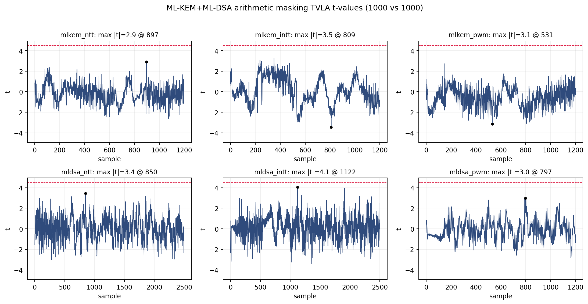
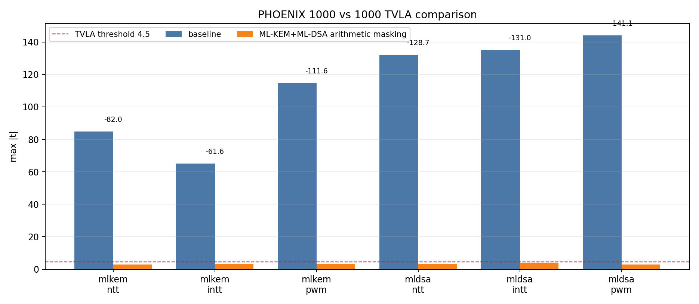

# Stage AM4: ML-KEM + ML-DSA Full Arithmetic Masking

작성일: 2026-05-21 KST

## 목적

AM3까지는 ML-KEM만 first-order arithmetic masking을 적용했고, ML-DSA는 기존
unmasked Montgomery datapath가 남아 있었다. 그래서 full six-op TVLA에서는 ML-KEM만
threshold 아래로 내려가고 ML-DSA `ntt/intt/pwm`은 여전히 큰 leakage candidate였다.

AM4의 목적은 ML-DSA에도 같은 원칙의 two-share arithmetic masking을 적용해,
ML-KEM과 ML-DSA 여섯 operation을 모두 같은 bitstream에서 fixed-vs-random TVLA로
검증하는 것이다.

## 구현 요약

기준 RTL은 AM3의 ML-KEM masking RTL이다. 여기에 ML-DSA를 Montgomery-domain 그대로
두고 share만 추가했다. 즉 Solinas branch처럼 arithmetic domain을 바꾸지 않았다.

```text
ML-DSA coefficient x는 Montgomery residue 상태 그대로 유지
x = x0 + x1 mod 8380417
share1 = x1 = fresh random residue
share0 = x0 = x - x1 mod 8380417
```

region 구조는 AM3와 동일하다.

| Region | 의미 | 사용 |
|---:|---|---|
| 0 | data/share0 memory | 기존 architectural data memory |
| 1 | share1 mask memory | ML-KEM, ML-DSA mask share |
| 2 | random tape memory | PWM masked multiplication용 fresh `r` |

fixed TVLA group에서도 secret value만 fixed이고 share1/random tape는 trace마다 새로 만든다.
따라서 fixed/random class 차이가 active arithmetic value로 직접 보이지 않도록 한다.

## Datapath 적용 위치

### Memory read/write

`rtl/phoenix/phoenix_top.v`에서 기존 data memory `u_pm` 옆에 mask memory `u_pm_mask`와
random tape memory `u_pm_rand`를 유지한다. AM4에서는 ML-KEM뿐 아니라 ML-DSA에서도
같은 bank/address로 share0과 share1을 읽고, writeback도 share0은 region 0,
share1은 region 1로 되돌려 쓴다.

ML-DSA PWM은 operand 배치가 NTT/INTT와 달라서 다음처럼 연결했다.

| 신호 | share0 | share1 |
|---|---|---|
| `sbu*_a` | unused라 `0` | unused라 `0` |
| `sbu*_b` | down memory operand | down mask operand |
| `sbu*_c` | up memory operand | up mask operand |
| `sbu*_p` | region 2 random tape | region 2 random tape |

### COMP1 / COMP2 / COMP4

`rtl/sbu/superbutterfly_sbu_routed.v`에서 ML-DSA NTT/INTT의 add/sub/div2 계열을
share-wise로 계산한다.

```text
real output share0 = f(input share0)
mask output share1 = f(input share1)
recombine        = share0 + share1 mod q
```

NTT/INTT의 zeta는 public constant이므로 `constant_share0 = zeta`,
`constant_share1 = 0`으로 본다. 따라서 public-constant multiplication도 share-wise
Montgomery multiplication으로 처리할 수 있다.

### COMP3 ML-DSA PWM

ML-DSA PWM은 secret-secret multiplication이므로 단순 share-wise multiplication으로는
충분하지 않다. 새 모듈 `rtl/comp/comp3_mldsa_masked_mul.v`에서 네 개의 Montgomery
product를 만들고 random tape `r`로 output share를 다시 섞는다.

```text
x = x0 + x1
y = y0 + y1

p00 = MontMul(x0, y0)
p01 = MontMul(x0, y1)
p10 = MontMul(x1, y0)
p11 = MontMul(x1, y1)

z0 = p00 + r
z1 = p01 + p10 + p11 - r
z  = z0 + z1 = MontMul(x, y)
```

여기서 `MontMul`은 기존 ML-DSA `mldsa_karatsuba24 -> mldsa_montgomery_reduce`
경로를 그대로 사용한다. 즉 AM4는 ML-DSA reduction 알고리즘을 바꾸는 실험이 아니라,
기존 Montgomery arithmetic 위에 share masking을 얹은 실험이다.

## 구현 파일

| 파일 | 변경 내용 |
|---|---|
| `rtl/comp/comp3_mldsa_masked_mul.v` | ML-DSA four-product masked Montgomery multiplier 추가 |
| `rtl/sbu/superbutterfly_sbu_routed.v` | ML-DSA COMP1/2/3/4 share path와 mask output mux 추가 |
| `rtl/phoenix/phoenix_top.v` | ML-DSA mask memory read/write, PWM random tape read, ML-DSA PWM mask operand 연결 |
| `scripts/tvla/phoenix_capture_tvla.py` | ML-DSA trace마다 share split과 random tape preload |
| `model/golden_arithmetic.py` | ML-DSA share split/recombine helper |
| `tb/tb_mldsa_masked_sbu.sv` | ML-DSA masked SBU recombine 검증 |

## 검증

### Functional / Verilator

다음 검증을 통과했다.

```bash
python3 -m py_compile scripts/tvla/phoenix_capture_tvla.py scripts/tvla/phoenix_cw305_lib.py model/golden_arithmetic.py
python3 scripts/diagnostics/check_phoenix_consistency.py
python3 scripts/diagnostics/check_bank_conflicts.py
bash sim/run_verilator.sh 'tb_comp1_comp2_comp4 tb_comp3_agile_modmul tb_mldsa_masked_sbu tb_mlkem_masked_sbu tb_superbutterfly_all_modes tb_phoenix_core tb_phoenix_host_io tb_phoenix_cw305_wrapper tb_phoenix_mldsa_pwm_io'
```

주요 결과:

| Testbench | 결과 |
|---|---|
| `tb_mldsa_masked_sbu` | `checks=1200 errors=0 PASS` |
| `tb_mlkem_masked_sbu` | `checks=1200 errors=0 PASS` |
| `tb_superbutterfly_all_modes` | `checks=4000 errors=0 PASS` |
| `tb_phoenix_core` | `checks=8 errors=0 PASS` |
| `tb_phoenix_host_io` | `checks=7 errors=0 PASS` |
| `tb_phoenix_cw305_wrapper` | `checks=10 errors=0 PASS` |
| `tb_phoenix_mldsa_pwm_io` | `checks=512 errors=0 PASS` |

### CW305 Build

30ns constraint 기준으로 bitstream을 재생성했고 timing을 만족했다.

| 항목 | 값 |
|---|---:|
| bitstream | `boards/cw305/output/phoenix_cw305.bit` |
| bitstream mtime | `2026-05-21 13:28:47 +0900` |
| WNS | `0.155 ns` |
| TNS | `0.000 ns` |
| WHS | `0.077 ns` |
| THS | `0.000 ns` |
| LUT | `26122` |
| FF | `5151` |
| RAMB36 | `24` |
| DSP | `0` |

AM3 대비 LUT는 크게 증가했다. 주된 이유는 각 SBU의 ML-DSA PWM masked multiplication이
기존 1개 Montgomery product가 아니라 `p00/p01/p10/p11` 네 개의
`mldsa_karatsuba24 + mldsa_montgomery_reduce` cone을 병렬로 만들기 때문이다. 대신
cycle count와 SBU latency 8은 유지했다.

## TVLA

사용자 요청에 따라 seed repeat는 수행하지 않았다. 장비 재연결 후 smoke를 먼저 돌리고,
이어서 full six-op 1000/1000 fixed-vs-random TVLA를 실행했다.

```bash
OUTDIR=reports/tvla/arithmetic_masking_mldsa_smoke_260521 \
OPS='mldsa_ntt mldsa_intt mldsa_pwm' \
TRACES=1 SECRET_DIST=auto TRACE_ORDER=shuffle ORDER_SEED=0x5EED \
bash scripts/tvla/run_mlkem_mldsa_1000.sh
```

```bash
OUTDIR=reports/tvla/arithmetic_masking_mldsa_full_260521 \
OPS='mlkem_ntt mlkem_intt mlkem_pwm mldsa_ntt mldsa_intt mldsa_pwm' \
TRACES=1000 SECRET_DIST=auto TRACE_ORDER=shuffle ORDER_SEED=0x5EED \
bash scripts/tvla/run_mlkem_mldsa_1000.sh
```

Full result:

| Operation | Original baseline | AM4 masked | peak index | cycles | clipping | 판단 |
|---|---:|---:|---:|---:|---:|---|
| `mlkem_ntt` | 84.901 | 2.904 | 897 | 248 | 0 | pass |
| `mlkem_intt` | 65.052 | 3.451 | 809 | 248 | 0 | pass |
| `mlkem_pwm` | 114.713 | 3.147 | 531 | 149 | 0 | pass |
| `mldsa_ntt` | 132.180 | 3.435 | 850 | 538 | 0 | pass |
| `mldsa_intt` | 135.012 | 4.053 | 1122 | 538 | 0 | pass |
| `mldsa_pwm` | 144.055 | 2.969 | 797 | 140 | 0 | pass |

TVLA overview:



Original baseline comparison:



비교 CSV:

`reports/tvla/arithmetic_masking_mldsa_full_260521/comparison_vs_original_baseline.csv`

## 판단

AM4는 현재까지의 strongest candidate다.

- ML-KEM과 ML-DSA 여섯 operation이 모두 1000/1000 fixed-vs-random TVLA에서
  threshold 4.5 아래로 내려갔다.
- cycle count는 유지됐다.
- 30ns timing도 통과했다.
- seed repeat는 사용자 요청으로 수행하지 않았다. 따라서 논문/보고서에서는
  "single shuffled 1000/1000 full six-op pass"로 먼저 표기하고, 최종 제출 전에는
  별도 repeat 또는 더 큰 trace 수 확장이 필요하다고 남기는 것이 정직하다.

이 실험은 inactive dummy blanking이 아니라 active arithmetic masking이다. 즉 선택되지
않은 cone에 dummy를 넣는 방식이 아니라, 실제 계산되는 ML-KEM/ML-DSA operand 자체를
두 share로 나누고 SBU 전체가 share를 유지하도록 만든 것이다.
