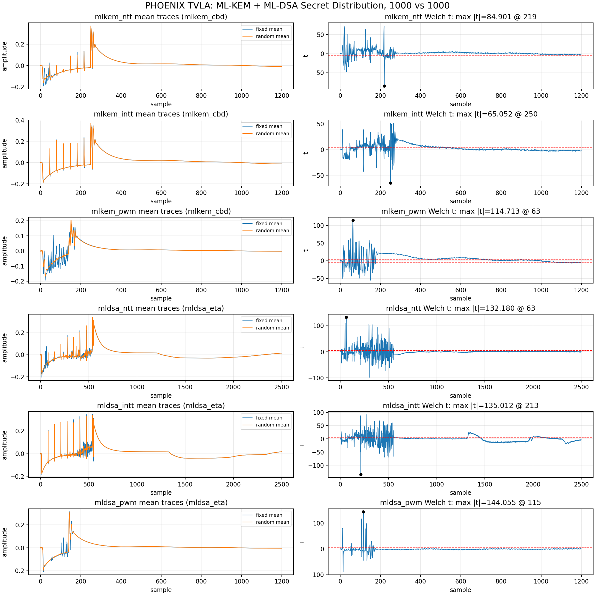

# Baseline: blanking 없는 기준 TVLA

## 목적

아무 datapath blanking을 넣지 않은 기준 RTL에서 fixed-vs-random TVLA leakage
shape를 확인했다. 이후 모든 Stage는 이 baseline 또는 Stage 4b를 기준으로 A/B
비교했다.

## 기준 RTL

Baseline RTL은 invalid/unused datapath를 의도적으로 지우지 않는다. 따라서 다음
현상이 가능하다.

- invalid SBU pipeline stage가 이전 operand를 유지한다.
- memory read output register가 이전 memory 값을 유지한다.
- output mux가 선택하지 않는 COMP block도 secret operand를 보고 toggle한다.
- COMP3의 KEM/DSA cone은 `opmode_i`와 무관하게 같은 `a_i/b_i`를 본 뒤 output mux만 선택된다.

## TVLA 실행

```bash
OUTDIR=reports/tvla/mlkem_mldsa_secretdist_20260519_cw305_husky_1000 \
OPS='mlkem_ntt mlkem_intt mlkem_pwm mldsa_ntt mldsa_intt mldsa_pwm' \
TRACES=1000 SECRET_DIST=auto \
bash scripts/tvla/run_mlkem_mldsa_1000.sh
```



| Operation | max `|t|` | Peak index | Cycles | Clipping |
|---|---:|---:|---:|---:|
| `mlkem_ntt` | 84.901 | 219 | 248 | 0 |
| `mlkem_intt` | 65.052 | 250 | 248 | 0 |
| `mlkem_pwm` | 114.713 | 63 | 149 | 0 |
| `mldsa_ntt` | 132.180 | 63 | 538 | 0 |
| `mldsa_intt` | 135.012 | 213 | 538 | 0 |
| `mldsa_pwm` | 144.055 | 115 | 140 | 0 |

## 판단

모든 operation이 threshold `4.5`를 크게 넘었다. 값이 60-140대이므로 threshold
해석 문제가 아니라 명확한 first-order leakage 후보로 보았다.

## 복구 방법

현재 Stage 4b RTL에서 original blanking-free baseline으로 돌아가려면 다음
종류의 변경을 모두 되돌려야 한다.

- `poly_memory_updown.v`의 read-enable output zeroing 제거.
- `superbutterfly_sbu_routed.v`의 invalid-cycle zero/PRD flushing 제거.
- `sbu_pair_pe.v`의 invalid cascade zeroing 제거.
- `superbutterfly_sbu_routed.v`의 COMP1/2/4 active unused-input zero mux 제거.

다만 현재 연구 기준은 Stage 4b이므로 baseline 복귀는 분석 목적 외에는 권장하지 않는다.
