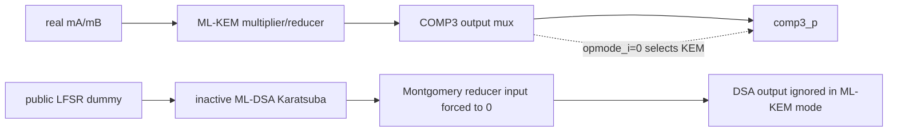
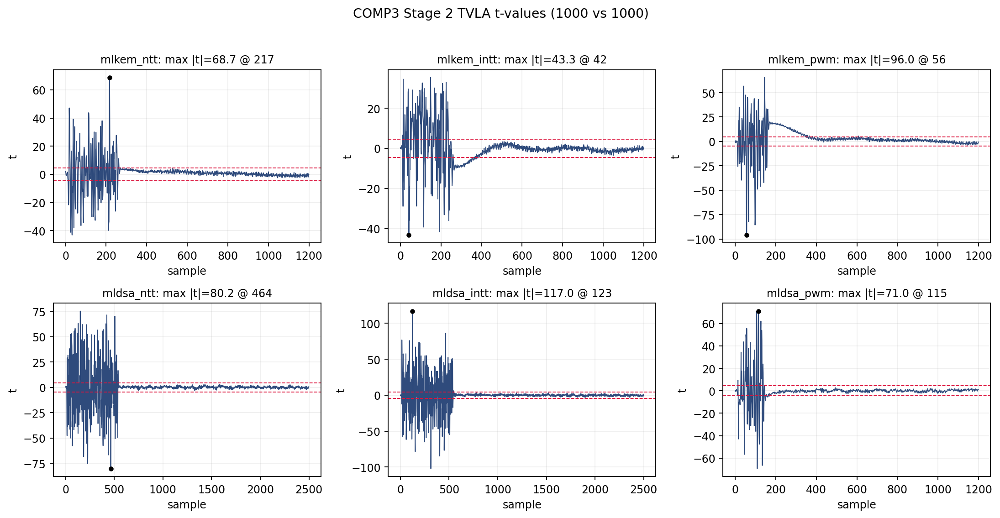
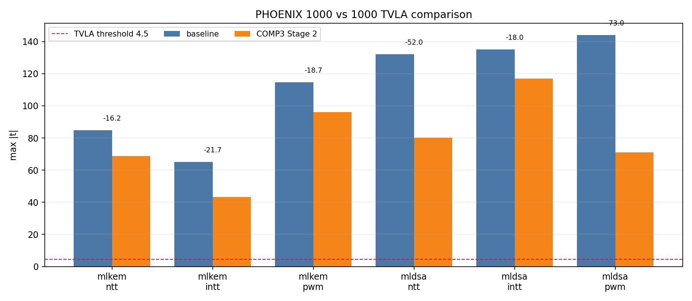
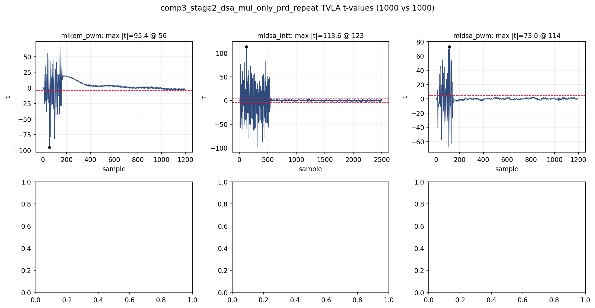

# Stage 2: DSA Karatsuba-Only PRD In ML-KEM Mode

## 목적

이전 COMP3 inactive-cone PRD는 ML-KEM mode에서 inactive DSA cone 전체에 PRD를 넣었다.
그 결과 ML-KEM은 크게 좋아졌지만 ML-DSA가 악화했다. 이번 Stage는 그 ML-KEM 개선이
DSA Karatsuba multiplier switching 때문인지 먼저 분리한다.

## 구현 원칙

- ML-KEM mode:
  - KEM active output path는 real operand 유지.
  - inactive DSA Karatsuba input만 public PRD로 교체.
  - DSA Montgomery reducer input은 `0`으로 고정.
- ML-DSA mode:
  - DSA active path는 real operand 유지.
  - KEM inactive path에는 별도 PRD/zero를 추가하지 않는다.
- output mux는 변경하지 않는다.

## Data-path blanking 적용 위치

보고서에서 이 실험을 설명할 때의 핵심은 다음과 같다.

```text
부채널 누설을 줄이기 위해,
최종 결과로 선택되지 않는 COMP3 내부 ML-DSA 곱셈 경로가
secret operand를 보고 불필요하게 toggle하지 않도록 만들었다.

구체적으로는 ML-KEM 실행 중 inactive ML-DSA Karatsuba 입력에
secret operand 대신 public PRD dummy를 넣고,
그 뒤 Montgomery reducer 입력은 0으로 blanking했다.
```

이 Stage에서 적용한 data-path blanking은 COMP3 내부의 **선택되지 않는 ML-DSA 곱셈
경로**에만 들어간다. 쉽게 말하면, ML-KEM을 계산하는 동안 COMP3 안에는 아래 두 회로가
동시에 존재한다.

```text
COMP3
  ML-KEM cone: 16-bit x 16-bit lane 곱셈 + Kyber Barrett reduction
  ML-DSA cone: 24-bit x 24-bit Karatsuba 곱셈 + Dilithium Montgomery reduction
```

ML-KEM mode에서는 최종 출력 mux가 ML-KEM cone 결과만 선택한다. 따라서 ML-DSA cone은
architectural output으로는 쓰이지 않는 inactive path다. 이 실험은 바로 그 inactive path 중
**ML-DSA Karatsuba multiplier 입력만 public PRD로 흔들고**, 뒤쪽 Montgomery reducer 입력은
`0`으로 막았다.



### SuperButterfly 회로 관점

아래 그림은 원 PHOENIX의 SuperButterfly 구조를 기준으로, 이 실험 RTL에서 어느 경로에
`real`, `0`, `public PRD`가 들어가는지 표시한 것이다. 파란색은 deterministic zero
blanking이고, 주황색은 public PRD dummy가 들어가는 지점이다.

```mermaid
flowchart LR
    classDef comp fill:#ffe08a,stroke:#111827,stroke-width:1.5px,color:#111827;
    classDef mux fill:#ecfeff,stroke:#0891b2,stroke-width:1.5px,color:#111827;
    classDef zero fill:#dbeafe,stroke:#2563eb,stroke-width:1.5px,color:#111827;
    classDef prd fill:#ffedd5,stroke:#f97316,stroke-width:1.5px,color:#111827;
    classDef real fill:#ffffff,stroke:#111827,stroke-width:1.2px,color:#111827;
    classDef note fill:#f8fafc,stroke:#64748b,stroke-dasharray:4 3,color:#111827;

    SEL["sel[8:0]\noperation decode"]:::note

    subgraph SBU["SuperButterfly datapath with blanking"]
      direction LR

      AIN["a_i"]:::real
      BIN["b_i"]:::real
      CIN["c_i / zeta"]:::real

      C2MUX["COMP2 input mux\nINTT: real b1,a1\nelse: 0,0"]:::mux
      C2ZERO["0 for NTT/PWM/MOD_ADD/ML-DSA_PWM"]:::zero
      COMP2(("COMP2\n+/- / div2")):::comp

      C3MUX["COMP3 operand mux\nPWM/INTT operand select"]:::mux
      COMP3K["COMP3 KEM cone\n16x16 lanes + Barrett\nreal active path"]:::comp
      COMP3D["COMP3 DSA Karatsuba\ninactive in ML-KEM"]:::comp
      PRD["public PRD LFSR\n32'h243F6A88 seed\nadvance on valid_i"]:::prd
      DRED0["0 into DSA Montgomery reducer\nwhen ML-KEM mode"]:::zero
      C3OUT["COMP3 output mux\nopmode=0: kem_out\nopmode=1: dsa_out"]:::mux

      DELAY["pipeline align\np6/q6/a6/b6/c6"]:::note

      C1MUX["COMP1 input mux\nused ops: real\nML-DSA_PWM/default: 0,0"]:::mux
      C1ZERO["0 for ML-DSA_PWM/default"]:::zero
      COMP1(("COMP1\n+ / div2")):::comp

      C4MUX["COMP4 input mux\nNTT/PWM1/ML-KEM INTT: real\nelse: 0,0"]:::mux
      C4ZERO["0 for ML-DSA_INTT/PWM0/ML-DSA_PWM/MOD_ADD/default"]:::zero
      COMP4(("COMP4\n+/-")):::comp

      OUTMUX["output mux\nselect y0/y1"]:::mux
      Y0["y0_o"]:::real
      Y1["y1_o"]:::real

      BIN --> C2MUX
      AIN --> C2MUX
      C2ZERO -. "non-INTT" .-> C2MUX
      C2MUX --> COMP2

      AIN --> C3MUX
      BIN --> C3MUX
      CIN --> C3MUX
      COMP2 --> C3MUX
      C3MUX --> COMP3K
      C3MUX --> COMP3D
      PRD -- "ML-KEM mode only\nPRD -> DSA Karatsuba a/b" --> COMP3D
      COMP3D --> DRED0
      COMP3K --> C3OUT
      DRED0 --> C3OUT
      C3OUT --> DELAY
      COMP2 --> DELAY

      DELAY --> C1MUX
      C1ZERO -. "unused COMP1" .-> C1MUX
      C1MUX --> COMP1

      DELAY --> C4MUX
      C4ZERO -. "unused COMP4" .-> C4MUX
      C4MUX --> COMP4

      COMP1 --> OUTMUX
      COMP4 --> OUTMUX
      DELAY -- "p6 direct for INTT/PWM0/ML-DSA_PWM" --> OUTMUX
      OUTMUX --> Y0
      OUTMUX --> Y1
    end

    SEL -. "controls real/zero/PRD selection" .-> C2MUX
    SEL -.-> C3OUT
    SEL -.-> C1MUX
    SEL -.-> C4MUX
    SEL -.-> OUTMUX
```



정확한 적용 표는 다음과 같다.

| 위치 | 조건 | 넣은 값 | 의미 |
|---|---|---|---|
| `superbutterfly_sbu_routed.v`의 `comp3_internal_dummy_lfsr` | `valid_i=1`마다 갱신 | 32-bit LFSR PRD | secret이 아닌 public dummy source |
| `comp3_agile_modmul.v`의 `dummy_a_i[23:0]` | `opmode_i=0`, 즉 ML-KEM mode | PRD 하위 24-bit | inactive ML-DSA Karatsuba `a` 입력 |
| `comp3_agile_modmul.v`의 `dummy_b_i[23:0]` | `opmode_i=0`, 즉 ML-KEM mode | rotate/XOR된 PRD 하위 24-bit | inactive ML-DSA Karatsuba `b` 입력 |
| `comp3_agile_modmul.v`의 `dsa_red_in` | `opmode_i=0`, 즉 ML-KEM mode | `64'b0` | inactive DSA Montgomery reducer 쪽으로 PRD가 전파되지 않게 차단 |
| `comp3_agile_modmul.v`의 output mux | 모든 cycle | 변경 없음 | ML-KEM mode에서는 `kem_out`, ML-DSA mode에서는 `dsa_out` 선택 |

### COMP1/COMP2/COMP3/COMP4 전체 적용 내용

이 실험에 포함된 data-path blanking은 두 종류다.

1. **deterministic zero blanking**: 현재 instruction에서 의미 있는 출력으로 쓰이지 않는
   COMP 입력을 `0`으로 둔다.
2. **public PRD dummy switching**: 선택되지 않는 COMP3 내부 ML-DSA Karatsuba cone에만
   LFSR 기반 dummy 값을 넣어, secret operand 기반 switching을 public switching으로 바꾼다.

즉 이 실험은 “COMP1/2/3/4에 전부 random을 넣은 설계”가 아니다. 전체 구조는 아래와 같다.

| block | 위치 | 어떤 instruction에서 real operand를 넣는가 | 어떤 instruction에서 `0`을 넣는가 | PRD/random dummy 적용 |
|---|---|---|---|---|
| COMP1 | `superbutterfly_sbu_routed.v`, Phase B | NTT, INTT, ML-KEM PWM0/PWM1, MOD_ADD | ML-DSA PWM, default/invalid | 없음 |
| COMP2 | `superbutterfly_sbu_routed.v`, Phase A | ML-KEM INTT, ML-DSA INTT | NTT, PWM, MOD_ADD, ML-DSA PWM, default/invalid | 없음 |
| COMP3 | `superbutterfly_sbu_routed.v` + `comp3_agile_modmul.v`, Phase A | active multiply path는 항상 real operand 유지 | ML-KEM mode에서 inactive DSA reducer 입력만 `0` | ML-KEM mode에서 inactive DSA Karatsuba 입력만 public PRD |
| COMP4 | `superbutterfly_sbu_routed.v`, Phase B | NTT, ML-KEM INTT, ML-KEM PWM1 | ML-DSA INTT, ML-KEM PWM0, ML-DSA PWM, MOD_ADD, default/invalid | 없음 |

각 COMP별 의미를 더 풀면 다음과 같다.

#### COMP1

COMP1은 Phase B의 post-multiply add/div2 계열 블록이다. output mux가 COMP1 결과를 쓰는
operation에서는 real input을 넣고, COMP1 결과가 필요 없는 operation에서는 입력을 `0`으로
둔다.

| selector | COMP1 input |
|---|---|
| `SBU_NTT_CT`, `SBU_MLDSA_NTT` | `a6`, `p6` real input |
| `SBU_INTT_GS`, `SBU_MLDSA_INTT` | `a6`, `b6` real input, div2 mode |
| `SBU_PWM0`, `SBU_PWM1`, `SBU_MOD_ADD` | 해당 operation에 필요한 real input |
| `SBU_MLDSA_PWM`, default/invalid | `0`, `0` |

여기에는 public PRD를 넣지 않는다. 목적은 COMP1이 결과에 필요 없는 ML-DSA PWM/default
cycle에서 secret-derived operand를 보고 불필요하게 toggle하지 않도록 막는 것이다.

#### COMP2

COMP2는 Phase A의 pre-multiply add/sub/div2 블록이며, INTT에서 COMP3로 들어갈 값을
만드는 데 쓰인다. 따라서 INTT 계열에서만 real input을 넣고, 나머지 operation에서는 입력과
control을 모두 `0`으로 둔다.

| selector | COMP2 input |
|---|---|
| `SBU_INTT_GS`, `SBU_MLDSA_INTT` | `b1`, `a1` real input, subtract/div2 mode |
| NTT, PWM, MOD_ADD, ML-DSA PWM, default/invalid | `0`, `0`, control `0` |

이 실험에서는 COMP2에 public PRD를 넣지 않는다. 후속 조합 실험에서는 COMP2 internal PRD도
따로 측정했지만, 이 문서의 “six-op 모두 감소” 결과는 COMP2 PRD 없이 얻은 결과다.

#### COMP3

COMP3는 multiplier/reducer 블록이다. 외부에서 보면 COMP3 output mux는 mode에 따라
ML-KEM 결과 또는 ML-DSA 결과를 선택한다.

| mode | active output | inactive cone 처리 |
|---|---|---|
| ML-KEM mode, `opmode_i=0` | KEM 16-bit lane multiplier + Barrett reducer 결과 `kem_out` | inactive DSA Karatsuba 입력에 public PRD, inactive DSA Montgomery reducer 입력은 `0` |
| ML-DSA mode, `opmode_i=1` | DSA 24-bit Karatsuba + Montgomery reducer 결과 `dsa_out` | KEM cone은 별도 PRD/zero 없이 real `a_i/b_i` 기반 switching 유지 |

이 실험의 핵심 기법은 바로 첫 번째 줄이다. ML-KEM을 수행할 때 output으로 선택되지 않는
ML-DSA Karatsuba가 secret operand를 보지 않도록, `a_i[23:0]`, `b_i[23:0]` 대신
`dummy_a_i[23:0]`, `dummy_b_i[23:0]`를 넣는다. 그리고 그 dummy product가 DSA
Montgomery reducer까지 전파되면 ML-DSA 쪽 switching이 과해질 수 있으므로 reducer 입력은
`64'b0`으로 끊었다.

#### COMP4

COMP4는 Phase B의 post-multiply subtract 블록이다. NTT와 PWM1에서는 output mux가 COMP4
결과를 사용한다. ML-KEM INTT에서는 output mux가 COMP4 결과를 직접 쓰지는 않지만, 이전
ablation에서 이 switching을 완전히 끄면 ML-KEM INTT가 악화했기 때문에 real input을 유지한다.
그 외 operation에서는 COMP4 입력을 `0`으로 둔다.

| selector | COMP4 input |
|---|---|
| `SBU_NTT_CT`, `SBU_MLDSA_NTT` | `a6`, `p6` real input |
| `SBU_INTT_GS` | `a6`, `p6` real input, ML-KEM INTT switching 유지 |
| `SBU_PWM1` | `p6[15:0]`, `comp1_y[15:0]` real input |
| `SBU_MLDSA_INTT`, `SBU_PWM0`, `SBU_MLDSA_PWM`, `SBU_MOD_ADD`, default/invalid | `0`, `0` |

여기에도 public PRD를 넣지 않는다. COMP4는 deterministic zero blanking만 적용한다.

요약하면 이 문서의 실험 RTL은 다음과 같이 설명할 수 있다.

```text
COMP1: 필요 없는 cycle에서 input zero
COMP2: INTT가 아닌 cycle에서 input/control zero
COMP3: ML-KEM mode의 inactive DSA Karatsuba에 public PRD,
       inactive DSA Montgomery reducer에는 zero
COMP4: NTT/PWM1/ML-KEM INTT 외에는 input zero
```

후속 실험인 Stage 6c에서는 여기에 COMP2 internal PRD까지 추가했지만, Stage 6c는
`mldsa_intt` worst를 더 낮춘 대신 `mlkem_intt`가 올라갔다. 그래서 "six-op 모두 감소"라는
조건으로 보면 이 문서의 Stage 2가 더 깔끔한 단일 후보이고, "worst 최소화" 기준으로는
Stage 6c가 더 강한 후보다.

여기서 PRD는 true random/TRNG가 아니라 LFSR 기반 pseudo-random dummy다. 보안 주장은
“random mask를 섞었다”가 아니라, **선택되지 않는 data-path가 secret operand를 보고
toggle하지 않도록 public dummy switching으로 바꿨다**는 것이다.

### 코드 단위 구현

`rtl/sbu/superbutterfly_sbu_routed.v`에서 public dummy source를 만든다.

```verilog
reg [31:0] comp3_internal_dummy_lfsr;
wire comp3_internal_dummy_fb = comp3_internal_dummy_lfsr[31] ^
                               comp3_internal_dummy_lfsr[22] ^
                               comp3_internal_dummy_lfsr[2] ^
                               comp3_internal_dummy_lfsr[1];
wire [31:0] comp3_internal_dummy_next =
    {comp3_internal_dummy_lfsr[30:0], comp3_internal_dummy_fb};
```

reset seed는 `32'h243F6A88`이고, `valid_i` cycle마다 한 번 advance된다. 이 값은
COMP3 인스턴스의 dummy port로만 전달된다.

```verilog
comp3_agile_modmul u_comp3 (
    .a_i(mA),
    .b_i(mB),
    .dummy_a_i(comp3_internal_dummy_a),
    .dummy_b_i(comp3_internal_dummy_b),
    .opmode_i(opmode1),
    .c_o(comp3_p)
);
```

`rtl/comp/comp3_agile_modmul.v`에서는 ML-KEM mode일 때만 ML-DSA Karatsuba 입력을
dummy로 바꾼다.

```verilog
wire [23:0] dsa_mul_a = (USE_PRD_DSA_MUL_ONLY_IN_KEM && !opmode_i) ?
                        dummy_a_i[23:0] : a_i[23:0];
wire [23:0] dsa_mul_b = (USE_PRD_DSA_MUL_ONLY_IN_KEM && !opmode_i) ?
                        dummy_b_i[23:0] : b_i[23:0];
```

같은 ML-KEM mode에서 DSA reducer 입력은 `0`으로 blanking한다.

```verilog
wire [63:0] dsa_red_in = (USE_PRD_DSA_MUL_ONLY_IN_KEM && !opmode_i) ?
                          64'b0 : {16'b0, dsa_raw48};
```

마지막 출력 선택은 그대로다.

```verilog
assign c_o = opmode_i ? dsa_out : kem_out;
```

따라서 이 Stage의 핵심은 다음 한 문장으로 요약된다.

```text
ML-KEM 실행 중에는 active KEM 계산은 그대로 두고,
출력으로 선택되지 않는 ML-DSA Karatsuba 입력만 public PRD로 바꾸며,
ML-DSA reducer 입력은 0으로 막는다.
```

반대로 ML-DSA 실행 중에는 DSA active path에 PRD나 zero를 섞지 않는다. 즉 ML-DSA 기능
결과는 real operand 기반으로 계산된다.

## 실행 기록

- diagnostics:
  - `check_phoenix_consistency.py`: PASS
  - `check_bank_conflicts.py`: PASS
- Verilator:
  - `tb_comp3_agile_modmul`
  - `tb_superbutterfly_all_modes`
  - `tb_phoenix_core`
  - `tb_phoenix_host_io`
  - `tb_phoenix_cw305_wrapper`
  - `tb_phoenix_mldsa_pwm_io`
  - 결과: PASS, `tb_phoenix_mldsa_pwm_io cycles=140`
- Vivado 30ns build:
  - bitstream mtime: `2026-05-21 11:15:47 KST`
  - WNS/TNS: `0.113 ns / 0.000 ns`
  - WHS/THS: `0.056 ns / 0.000 ns`
  - LUT/FF/RAMB36/DSP: `9977 / 3350 / 8 / 0`
- artifact:
  - `../../reports/tvla/comp3_internal_stage2_dsa_mul_only_prd_260521/phoenix_comp3_stage2_dsa_mul_only_prd.bit`
  - `../../reports/tvla/comp3_internal_stage2_dsa_mul_only_prd_260521/phoenix_comp3_stage2_dsa_mul_only_prd_timing.rpt`
  - `../../reports/tvla/comp3_internal_stage2_dsa_mul_only_prd_260521/phoenix_comp3_stage2_dsa_mul_only_prd_impl_util.rpt`
  - `../../reports/tvla/comp3_internal_stage2_dsa_mul_only_prd_260521/rtl_stage2_dsa_mul_only_prd.patch`

## TVLA 결과

명령:

```bash
OUTDIR=reports/tvla/comp3_internal_stage2_dsa_mul_only_prd_260521 \
OPS='mlkem_ntt mlkem_intt mlkem_pwm mldsa_ntt mldsa_intt mldsa_pwm' \
TRACES=1000 SECRET_DIST=auto TRACE_ORDER=shuffle ORDER_SEED=0x5EED \
PYTHON=/home/reo/.pyenv/versions/sca/bin/python \
bash scripts/tvla/run_mlkem_mldsa_1000.sh
```

| Operation | max `|t|` | peak index | cycles | clipping |
|---|---:|---:|---:|---:|
| `mlkem_ntt` | 68.726 | 217 | 248 | 0 |
| `mlkem_intt` | 43.319 | 42 | 248 | 0 |
| `mlkem_pwm` | 96.004 | 56 | 149 | 0 |
| `mldsa_ntt` | 80.229 | 464 | 538 | 0 |
| `mldsa_intt` | 117.028 | 123 | 538 | 0 |
| `mldsa_pwm` | 71.047 | 115 | 140 | 0 |

Original baseline TVLA overview:


Stage 2 TVLA overview:



Original baseline 직접 비교:

| Operation | Original baseline | Stage 2 | 변화 |
|---|---:|---:|---:|
| `mlkem_ntt` | 84.901 | 68.726 | -19.05% |
| `mlkem_intt` | 65.052 | 43.319 | -33.41% |
| `mlkem_pwm` | 114.713 | 96.004 | -16.31% |
| `mldsa_ntt` | 132.180 | 80.229 | -39.30% |
| `mldsa_intt` | 135.012 | 117.028 | -13.32% |
| `mldsa_pwm` | 144.055 | 71.047 | -50.68% |



비교 artifact:

- `../../reports/tvla/comp3_internal_stage2_dsa_mul_only_prd_260521/comparison_vs_original_baseline.png`
- `../../reports/tvla/comp3_internal_stage2_dsa_mul_only_prd_260521/comparison_vs_comp3_whole_cone_prd.png`

Key repeat:

```bash
OUTDIR=reports/tvla/comp3_internal_stage2_dsa_mul_only_prd_key_repeat_260521 \
OPS='mlkem_pwm mldsa_intt mldsa_pwm' \
TRACES=1000 SECRET_DIST=auto TRACE_ORDER=shuffle ORDER_SEED=0xC0DEC \
PYTHON=/home/reo/.pyenv/versions/sca/bin/python \
bash scripts/tvla/run_mlkem_mldsa_1000.sh
```

| Operation | max `|t|` | peak index | cycles | clipping |
|---|---:|---:|---:|---:|
| `mlkem_pwm` | 95.354 | 56 | 149 | 0 |
| `mldsa_intt` | 113.569 | 123 | 538 | 0 |
| `mldsa_pwm` | 72.984 | 114 | 140 | 0 |



## 판단

Original baseline 대비 six-op이 모두 낮아진 informative candidate다. 다만 TVLA pass는 아니다.

Original baseline과 직접 비교하면 `mlkem_ntt`, `mlkem_intt`, `mlkem_pwm`,
`mldsa_ntt`, `mldsa_intt`, `mldsa_pwm` 여섯 operation의 max `|t|`가 모두 낮아졌다.
key repeat에서도 `mlkem_pwm`, `mldsa_intt`, `mldsa_pwm`의 개선 신호가 유지되었다.
특히 이전 whole COMP3 inactive-cone PRD는 ML-KEM만 크게 개선하고 ML-DSA INTT/PWM을
악화했는데, 이번 Stage는 DSA Karatsuba만 흔들고 reducer를 zero로 고정했기 때문에
ML-DSA 악화가 크게 줄었다.

해석:

- Stage 6b/Inactive matrix Stage 2의 ML-KEM 개선 신호 중 상당 부분은 inactive DSA
  Karatsuba switching만으로도 설명된다.
- DSA Montgomery reducer까지 PRD를 전파하거나, ML-DSA mode에서 inactive KEM cone을
  PRD로 흔드는 부분이 이전 ML-DSA 악화의 원인일 가능성이 있다.
- 다음 Stage는 DSA reducer-only PRD를 독립적으로 측정해 이 가설을 확인한다.
